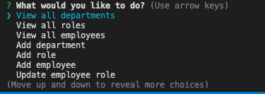

# Employee Tracker

  ## Description
  
  This project is a command-line application that allows the user to manage a company's employees. This project uses node inquirer and mySQL.

  ## User Story

```
As a business owner
I want to be able to view and manage the departments, roles, and employees in my company
So that I can organize and plan my business
```


  ## Table Of Contents
  
  * [Installation](#installation)
  
  * [Usage](#usage)
  
  * [Demo of Application](#demo-of-application)
  
  * [Questions](#questions)
  
  ## Installation
  
  To install necessary dependencies, run the following command:
  
  ```
  npm i
  ```
  Once dependencies are installed, the application is ready to run. 

  ## Usage

  To run the application from the command line please run the following command:

  ```
  node server.js
  ``` 
  
  Following the command, the user will be given options to perform


  
  

  The user can now view, add, or update information.

  
  ## Demo of Application
  

  *demo of command to run application and generated database information*


  ## Questions
  
  If you have any questions about this project, please contact ashleydeyoung at ashley.d.deyoung@gmail.com.